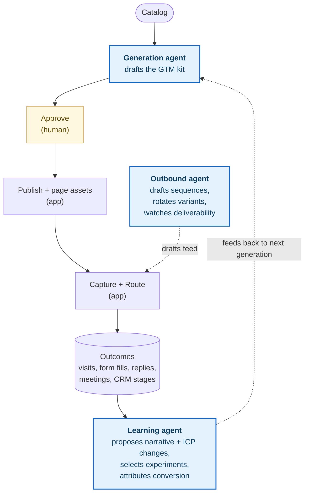

Mira's agentic layer drives the steps where AI judgment adds the most value: drafting positioning, picking outbound variants, and proposing narrative changes from outcome data. Three specialized agents cooperate across the loop. Each runs in the same per-job sandbox, under the same allowlist contract, with the same human gate on anything customer-visible.

## Where the agents fit

Three agents (boxed) sit on the loop alongside deterministic application steps and a single human approval gate. The rest of the system — catalog ingestion, publish, capture, route, audit — stays deterministic.

## Generation agent

The generation agent drafts the GTM kit when a catalog entry is added or marked stale. For one entry, it produces six sections in a single structured-output call:

- ICP hypotheses
- Positioning
- Messaging pillars
- Competitive angles
- Landing-page copy
- Outbound snippets

The output schema is fixed and validated; non-conforming sections surface as errors rather than silently slipping through. As the call streams, the agent emits per-section progress events (`Drafting ICP`, `Done ICP`, `Drafting Positioning`, …) so the workspace UI can show live progress without polling.

Per-section regeneration is cheap: re-running one section creates a new version of that section only, leaving the rest of the kit untouched.

## Outbound agent

The outbound agent turns approved kits into channel-ready material. It works on already-approved positioning and messaging — it cannot invent new claims. Its scope:

- Drafts email sequences from approved outbound snippets, with per-product personalization.
- Rotates between approved variants based on observed open / reply / meeting rates.
- Monitors deliverability signals (bounces, complaints, spam-trap hits) and throttles or pauses sequences when guardrails trip.
- Builds suppression and throttling rules per tenant.

Sending stays with the customer's mailbox or ESP — the agent owns sequencing logic, variant selection, and personalization, but never the sending infrastructure itself.

## Learning agent

The learning agent ingests the outcome stream — visits, form fills, replies, meetings, and CRM stages — and feeds it back into the workflow:

- Attributes conversion to the narrative variants that produced it.
- Recommends ICP refinements when observed conversion diverges from the original hypothesis.
- Proposes positioning and messaging-pillar edits for products whose performance is stalling.
- Selects which experiments to run next, given a budget of regeneration cost.

The agent does not edit kits autonomously — it surfaces proposals into the workspace, where the same human approval gate applies.

## Shared trust contract

Every agent runs the same way:

**Per-job sandbox.** Each invocation is a fresh subprocess started from a sealed workspace and torn down on completion. There is no long-running agent process; nothing carries from one job to the next except what the application persists.

**What an agent sees, per job:**

- The catalog entry (or outcome window) it's working on, and only that.
- The prompt templates checked into the application.
- The model spec for this job (model id and version).
- An explicit list of allowed tools and allowed network domains.

**What an agent does NOT see:**

- Database credentials.
- Application secrets or session cookies.
- Other tenants' data.
- The application API itself — even at the network level.

**Human gate.** Anything customer-visible — a published page, an outbound message, a CRM-attached note — is pinned to a human-approved version. If an agent proposes new content, that content sits in the draft state until rejected or approved. Bad output cannot escape the workspace.

If a model is poisoned by manipulated catalog input, or starts producing harmful output, the worst case is a bad draft.

## Reproducibility

Every artifact produced by any agent records what input and which model produced it: a hash of the source content (catalog entry, outcome window, etc.), a hash of the rendered prompts, the provider and model used, and the token cost.

Re-running the same agent against the same input with the same prompts and model is identifiable from those hashes alone — useful for cache invalidation, debugging drift, and tracing which inputs produced a given output.
