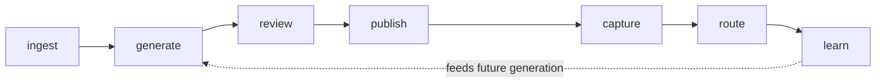

Mira turns a B2B SaaS product catalog into a set of executable go-to-market motions, one per catalog entry. Instead of organizing GTM around campaigns or accounts, Mira organizes it around the **product**.

## The seven-phase loop

The unit of work is the **catalog entry**, not the campaign or the prospect. Each entry flows through seven phases:

| Phase | What happens |
| --- | --- |
| Ingest | CSV / API / connector import, normalized into per-tenant catalog rows |
| Generate | LLM-driven kit generation (ICP, positioning, pillars, competitive angles, landing copy, outbound snippets) |
| Review | Humans approve customer-facing claims per section |
| Publish | Hosted landing page locked to approved versions of each section |
| Capture | Form submissions become tenant-scoped leads |
| Route | Webhook delivery to a CRM with retry |
| Learn | Per-product, per-narrative outcomes feed future generation passes |

## What Mira is not

- **Not a CRM.** Mira routes context to a CRM (HubSpot, Salesforce, or a generic signed webhook). It does not own contact, account, or opportunity records.
- **Not an unsupervised autonomous platform.** Specialized agents drive scoped tasks (drafting, variant selection, narrative iteration), but a human gates every customer-visible claim. Approval is non-negotiable.
- **Not a generic AI copywriter.** The product unit is the catalog entry, with persistent memory, approval gates, capture, routing, and outcome attribution all attached to it.
- **Not an outbound platform with owned SMTP/IP.** Mira drafts sequences, manages variants, and tracks deliverability — but sending stays with the customer's mailbox or ESP.
