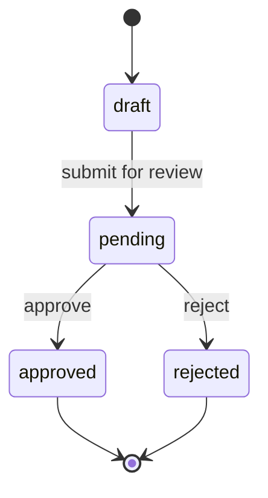

Approval is the trust contract between AI-generated drafts and customer-visible content. The versioning model exists to make that contract auditable, reversible, and impossible to bypass by accident.

## Approval state machine

Every section has versioned bodies. The approval state machine is one-way per version:

A new edit always creates a new version starting at `draft`. The previous version's state doesn't change; it remains in history exactly as approved or rejected.

## Why one-way

The state machine is one-way per version on purpose:

- **No accidental rollbacks.** A version can never move from `approved` back to `draft`. If you want to change an approved section, you create a new version — the existing approved version remains a stable artifact you can point to forever.
- **Every published version is provable.** Because each version's approval state is immutable, the audit log can answer "who approved this exact text and when" without ambiguity.

This is also why edits create new versions instead of mutating existing ones: you can never lose track of what was approved.

## Frozen published versions

When you publish a [hosted landing page](/mira/workflows/publish-landing-pages/) or export an [outbound sequence](/mira/workflows/run-outbound-sequences/), Mira **freezes** the currently-approved version of each relevant section onto that asset.

Subsequent edits to a section don't change what customers see. The page or sequence keeps pointing at the version that was approved at publish time. Republishing creates a new pinned snapshot.

## Re-approval after edits

If you edit an approved section, Mira creates a new version in `draft`. From there:

1. The new draft moves through `pending → approved` (or `rejected`).
2. Until you trigger a republish, the previously approved version remains the published version. Customers see no change.
3. When you republish, the new version is pinned and becomes the live asset.

This protects customer-facing surfaces from edits-in-flight: a half-finished revision never reaches a prospect.

## Audit visibility

Every transition is recorded in the [audit log](/mira/administration/audit-log/):

- Approver identity, timestamp, and any comment they left
- The version id before and after
- The action: `approve`, `reject`, or `request-changes`

Retention is at least 12 months and the log is immutable. If a published claim is challenged later, you can trace back through the log to the exact moment of approval and the person who signed off.

## Related

- [The GTM kit](/mira/concepts/the-gtm-kit/) — the sections that get versioned
- [Review & approve](/mira/workflows/review-and-approve/) — the workflow that drives the state machine
- [Audit log](/mira/administration/audit-log/) — where the trail lives
