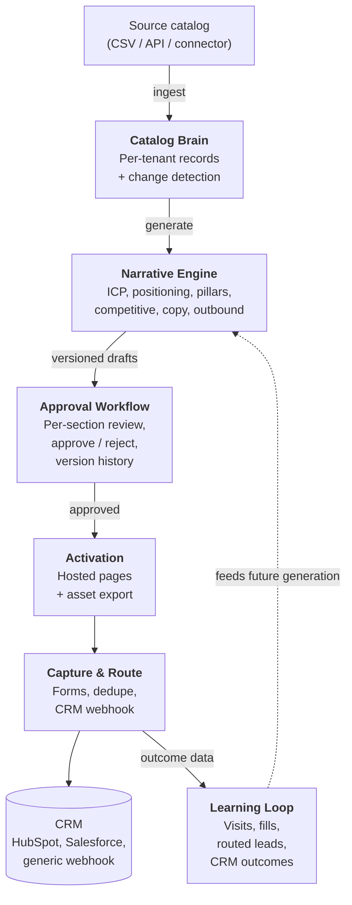

Mira is built around the product catalog. Source data flows in, AI drafts customer-facing assets, humans approve, the system publishes and captures intent, and outcomes flow back to inform future generations.

This page describes the major components and how they connect, without committing to a specific implementation.

## At a glance



## Major subsystems

### Catalog Brain

Stores the per-tenant product catalog. Each entry has source fields, a content hash for change detection, and metadata (audience, competitors, ownership). Re-importing a catalog only marks **changed** entries as stale — regeneration cost is bounded to what actually changed.

→ See [Onboard your catalog](/mira/workflows/onboard-your-catalog/).

### Narrative Engine

The AI-assisted generation pipeline. Given a catalog entry, the engine produces a GTM kit:

- ICP hypotheses
- Positioning
- Messaging pillars
- Competitive angles
- Landing-page copy
- Outbound snippets

Each section is generated and versioned independently. Re-generating one section does not invalidate the others, so partial regeneration is cheap and predictable.

A deterministic fallback is used in development when no LLM is reachable, so the system stays testable end-to-end without network access.

→ See [Generate GTM kits](/mira/workflows/generate-gtm-kits/).

### Approval Workflow

Every artifact is versioned, and every version moves through a one-way approval state:

```
draft → pending → approved
                → rejected
```

A new edit always creates a new version starting at draft. Published assets reference **frozen approved versions**, not the live artifact — so any edit to an approved kit requires re-approval before it can affect what customers see.

→ See [Review & approve](/mira/workflows/review-and-approve/).

### Activation

Hosted product landing pages, parameterized by approved artifact versions. Each page is published at a per-tenant slug; templates can be swapped without rewriting content. Approved assets can also be exported to the channels the customer already operates (sales engagement, sequencing, enablement).

→ See [Publish landing pages](/mira/workflows/publish-landing-pages/) and [Run outbound sequences](/mira/workflows/run-outbound-sequences/).

### Capture & Route

Forms on published pages capture intent, dedupe within a configurable window, and emit webhooks to a CRM (HubSpot, Salesforce, or a generic signed-webhook fallback). Webhook delivery has retry-with-backoff; failures surface in a delivery dashboard.

→ See [Capture & route leads](/mira/workflows/capture-and-route-leads/).

### Learning Loop

Per-product, per-narrative, per-channel outcomes — visits, form fills, replies, meetings, CRM stages — flow back into the system. The learning agent uses them to propose narrative and ICP changes for the next generation pass, and to attribute conversion back to the variants that produced it.

→ See [Learn from outcomes](/mira/workflows/learn-from-outcomes/).

## Tenants and isolation

Mira is multi-tenant from day one. Every business object belongs to a tenant, and tenants never see one another's data.

Tenant identity is established at sign-in and applied automatically at the platform layer on every read and write — application code can't accidentally cross the boundary by forgetting a filter. A continuously-running canary test exercises the boundary on every CI run.
