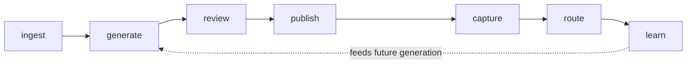

The workflows you actually drive in the product. Each phase has its own page covering the mechanics, the workflow steps, and links to the relevant integrations.

## The seven-phase loop

## What's in this section

- **[Onboard your catalog](/mira/workflows/onboard-your-catalog/)** — bring your catalog into Mira and manage it with filters, tags, and bulk operations.
- **[Generate GTM kits](/mira/workflows/generate-gtm-kits/)** — trigger generation, watch the streaming events, regenerate sections.
- **[Review & approve](/mira/workflows/review-and-approve/)** — the human gate on customer-facing claims; multi-approver, risky-claim flags, version locking.
- **[Publish landing pages](/mira/workflows/publish-landing-pages/)** — pick a template, configure a slug, point a custom domain, publish.
- **[Capture & route leads](/mira/workflows/capture-and-route-leads/)** — forms on hosted pages capture intent; routing rules deliver to your CRM.
- **[Run outbound sequences](/mira/workflows/run-outbound-sequences/)** — the outbound agent drafts sequences, rotates variants, watches deliverability.
- **[Learn from outcomes](/mira/workflows/learn-from-outcomes/)** — per-product metrics, cohort comparison, narrative-variant attribution.

## Related

- [Concepts](/mira/concepts/) — the mental model behind these workflows.
- [Integrations](/mira/integrations/) — external systems each workflow connects to.
