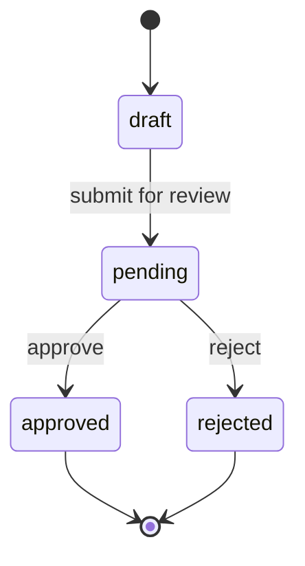

Approval is the human gate that sits between AI-generated drafts and customer-visible content. Nothing publishes without it.

## How it works

Every section of a GTM kit moves through a one-way state machine per version:



A new edit always creates a new version starting at `draft`. Published assets are pinned to **frozen approved versions**, not live drafts — so any edit to an approved kit requires re-approval before customers see anything new.

## Capabilities

- **Per-section** approve, reject, or request-changes — the kit's overall state derives from its sections.
- **Publishing is blocked** until all customer-facing sections are approved.
- **Approver identity** captured (user, timestamp, comment).
- **Version locking** — published artifact versions are immutable.
- **Multi-approver workflows** (e.g. PMM + legal + brand) configurable per tenant.
- **Risky-claim auto-flagging** against tenant-configurable rules; flagged claims need explicit attention before approval.

## Workflow

```
1. Open a generated section
2. Read; edit inline if needed; regenerate just that section if needed
3. Address risky-claim flags (rewrite or accept-with-comment)
4. Approve / reject / request-changes
5. Repeat per section
6. Once all required sections are approved, publishing unlocks
7. New edits create new versions, requiring re-approval
```

## Re-approval after edits

If you edit an approved section, Mira creates a new version in `draft`. The previously approved version remains the published version until the new one is approved and you trigger a republish — this protects customer-facing surfaces from accidental rollbacks.

## Audit history

Every approval, rejection, and edit is recorded in the [audit log](/mira/administration/audit-log/): who did what, when, and which version. The history is immutable.

## Related

- [Generate GTM kits](/mira/workflows/generate-gtm-kits/) — what produces the drafts
- [Publish landing pages](/mira/workflows/publish-landing-pages/) — what consumes approved content
